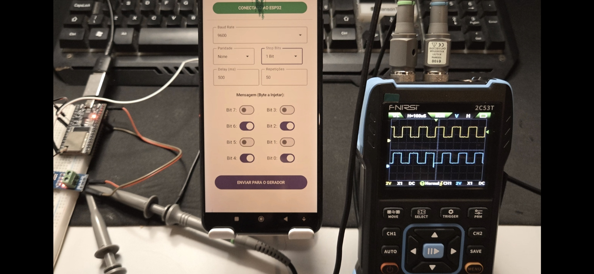

| Supported Targets | ESP32 |
| ----------------- | ----- |

Utilizado como Base de inicio o Tamplate Demo
## ESP-IDF BT-SPP-ACCEPTOR demo

O Codigo para ESP32 realiza a função de Injetor de Sinal No padrão Serial RS485.
Foi utilizado essa Biblooteca para comunicar via Bluetooth com  Com o APP do Celular  podendo configurar um Tipo de sinal padrão Do RS485, e realizar via Osciloscopio a degradação do Sinal Em um infraestrutura, Como o sinal é gerado através de uma placa TTL to 485 podemos injetar esse sinal na rede serial garantindo que não irá danificar possiveis equipamentos intalados na mesma rede, pois a placa TTL to 485 já atende os padrões eletricos. 

